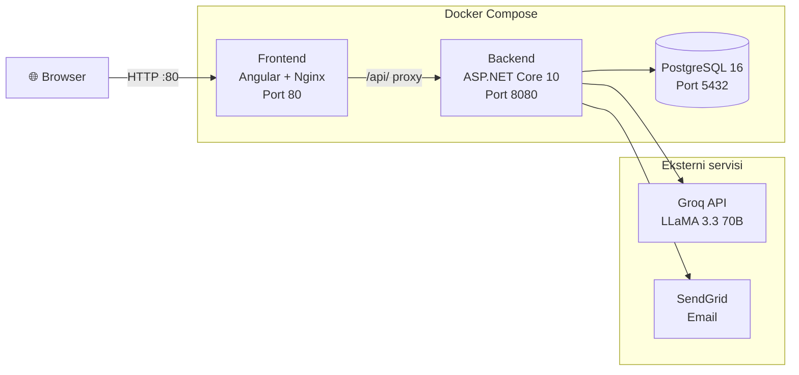
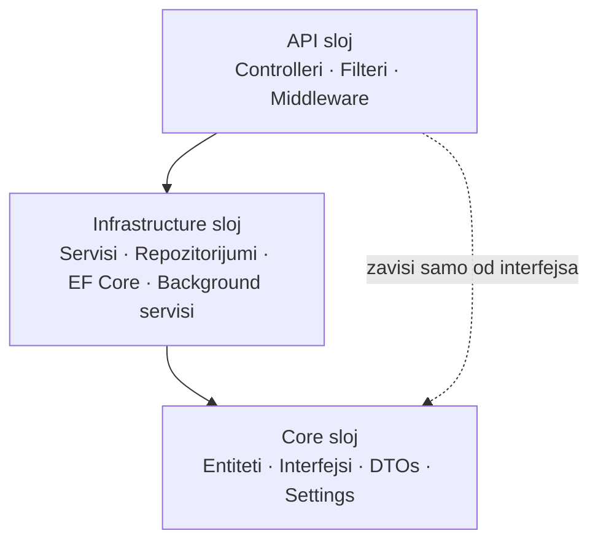
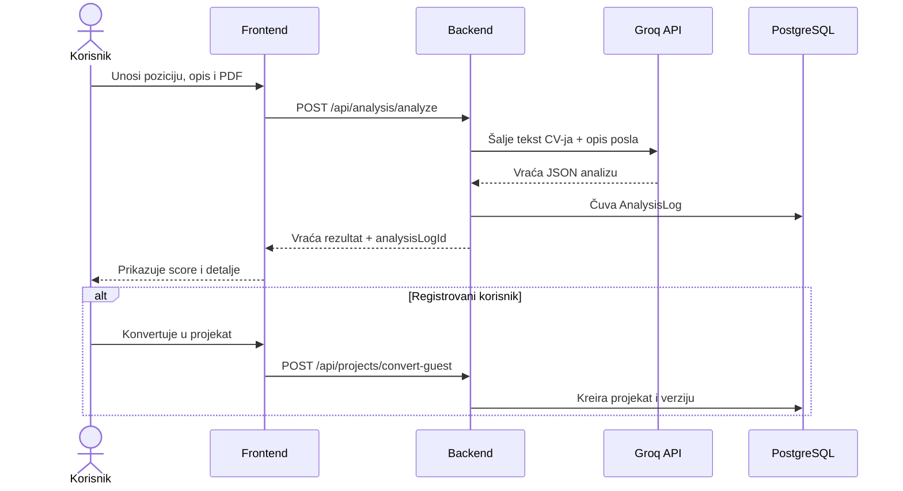

# SmartResumeAnalyzer

AI platforma za analizu CV-ja i praćenje prijava za posao. Korisnik unosi naziv pozicije, opis posla i PDF CV, a platforma vraća score poklapanja, prednosti, slabosti, nedostajuće ključne reči i predloge za poboljšanje.

## Funkcionalnosti

- **AI Analiza CV-ja** — score poklapanja, prednosti/slabosti, nedostajuće ključne reči i predlozi za poboljšanje (Groq / LLaMA 3.3 70B)
- **Gost mod** — analiza bez registracije (3 analize dnevno po IP adresi)
- **Upravljanje projektima** — organizovanje prijava po kompaniji i poziciji
- **Verzionisanje CV-ja** — više verzija CV-ja po projektu sa praćenjem napretka
- **Poređenje verzija** — uporedno poređenje analiza dve verzije CV-ja
- **Slanje prijava emailom** — AI generisani ili ručno napisani email putem SendGrid-a
- **Notifikacije** — automatski podsetnici za prijave u nacrtu i praćenje odgovora
- **Export PDF** — izvoz rezultata analize kao formatiran PDF dokument
- **Korisnički profil** — statistike sa istorijom prijava i trendovima score-ova

## Tehnologije

| Sloj | Tehnologija |
|------|-------------|
| Frontend | Angular 20 + PrimeNG 20 (Aura tema) |
| Backend | ASP.NET Core 10 — Clean Architecture |
| Baza podataka | PostgreSQL 16 + Entity Framework Core |
| AI | Groq API — LLaMA 3.3 70B Versatile |
| Email | SendGrid |
| Autentikacija | JWT tokeni |
| Testovi | Selenium WebDriver — Java + JUnit 5 + Maven |
| Kontejnerizacija | Docker + Docker Compose |

## Arhitektura

### Infrastruktura



### Backend — Clean Architecture



### Tok analize CV-ja



## Preduslovi

- [Docker](https://www.docker.com/get-started) i Docker Compose
- Git

Za lokalni razvoj bez Dockera:
- [Node.js 20+](https://nodejs.org/) i Angular CLI
- [.NET 10 SDK](https://dotnet.microsoft.com/download)
- PostgreSQL 16

## Pokretanje sa Dockerom

### 1. Kloniranje repozitorijuma

```bash
git clone https://github.com/jevticn-dev/smart-resume-analyzer.git
cd smart-resume-analyzer
```

### 2. Konfiguracija environment varijabli

```bash
cp .env.example .env
```

Izmeniti `.env` i popuniti vrednosti:

| Varijabla | Opis |
|-----------|------|
| `POSTGRES_PASSWORD` | Lozinka za PostgreSQL |
| `JWT_SECRET_KEY` | JWT ključ za potpisivanje tokena (minimum 32 karaktera) |
| `GROQ_API_KEY` | Groq API ključ — kreirati na [console.groq.com](https://console.groq.com) |
| `SENDGRID_API_KEY` | SendGrid API ključ — kreirati na [sendgrid.com](https://sendgrid.com) |
| `SENDGRID_FROM_EMAIL` | Verifikovani email sender u SendGrid nalogu |

### 3. Pokretanje

```bash
docker compose up --build
```

Aplikacija će biti dostupna na **http://localhost**.

> Prvo pokretanje traje nekoliko minuta — backend čeka da PostgreSQL bude spreman pre primene migracija.

### Zaustavljanje

```bash
docker compose down
```

Za brisanje svih podataka (baza i uploadovani CV-jevi):

```bash
docker compose down -v
```

## Lokalni razvoj (bez Dockera)

### Baza podataka

Pokrenuti samo bazu:

```bash
docker compose up postgres
```

### Backend

```bash
cd Backend/SmartResumeAnalyzer.API
dotnet run
```

Backend radi na `https://localhost:7139`. Koristi `appsettings.Development.json` — kopirati iz `appsettings.json` i popuniti vrednosti.

### Frontend

```bash
cd Frontend/smart-resume-analyzer
npm install --legacy-peer-deps
ng serve
```

Frontend radi na `http://localhost:4200`.

## Pokretanje Selenium testova

Testovi zahtevaju pokrenute sve tri komponente aplikacije (frontend + backend + baza).

### 1. Konfiguracija testova

```bash
cd Selenuim-Tests/src/test/resources
cp test.properties.example test.properties
```

Izmeniti `test.properties`:

| Svojstvo | Opis |
|----------|------|
| `test.email` | Email postojećeg test korisnika |
| `test.password` | Lozinka test korisnika |
| `cv.path` | Putanja do PDF CV fajla koji se koristi u testovima |
| `hr.email` | Email adresa koja se koristi kao HR primalac u email testovima |

Postaviti PDF CV fajl u `Selenuim-Tests/src/test/resources/` i ažurirati `cv.path`.

### 2. Pokretanje testova

```bash
cd Selenuim-Tests
mvn test
```

Pokretanje jedne test klase:

```bash
mvn test -Dtest=FullFlowTest
```

> Testovi se pokreću u Firefox-u. WebDriverManager automatski preuzima odgovarajući driver.

## Struktura projekta

```
smart-resume-analyzer/
│
├── Backend/                                        # ASP.NET Core 10
│   ├── SmartResumeAnalyzer.API/
│   │   ├── Controllers/                            # Analysis, Auth, Project, Email, Notification
│   │   ├── Extensions/                             # DI registrations, JWT configuration
│   │   ├── Filters/                                # RateLimitFilter
│   │   └── Middleware/                             # ExceptionHandlingMiddleware
│   │
│   ├── SmartResumeAnalyzer.Core/
│   │   ├── Configuration/                          # RateLimitSettings
│   │   ├── DTOs/                                   # Analysis, Auth, Email, Notification, Project
│   │   ├── Entities/                               # User, Project, CvVersion, AnalysisLog, Notification
│   │   ├── Exceptions/                             # AppException
│   │   ├── Interfaces/                             # IProjectService, IAuthService, IAnalysisLogService, ...
│   │   └── Settings/                               # JwtSettings, SendGridSettings, FileStorageSettings, ...
│   │
│   └── SmartResumeAnalyzer.Infrastructure/
│       ├── BackgroundServices/                     # NotificationBackgroundService
│       ├── Data/                                   # AppDbContext, Migrations
│       ├── Extensions/                             # InfrastructureServiceExtensions
│       ├── Repositories/                           # ProjectRepository, CvVersionRepository, AnalysisLogRepository
│       └── Services/                               # ProjectService, AuthService, AiAnalysisService, EmailService, ...
│
├── Frontend/
│   └── smart-resume-analyzer/
│       └── src/app/
│           ├── core/
│           │   ├── interceptors/                   # jwt-interceptor
│           │   ├── models/                         # auth, project, analysis, email, notification
│           │   └── services/                       # auth, project, analysis, email, notification, export, toast
│           ├── features/
│           │   ├── analysis/                       # analyze, result
│           │   ├── auth/                           # login, register
│           │   ├── landing/
│           │   ├── profile/
│           │   └── projects/                       # list, detail, create, edit, version-detail, version-compare
│           ├── layout/                             # Navbar
│           └── shared/                             # Reusable components
│
├── Selenuim-Tests/                                 # Java + Maven + JUnit 5
│   └── src/test/java/com/smartresumeanalyzer/
│       ├── base/                                   # BaseTest
│       ├── pages/                                  # Page Object classes
│       └── tests/                                  # AuthTest, ProjectTest, FullFlowTest
│
├── docker-compose.yml
├── .env.example
└── README.md
```

## Ključne arhitekturalne odluke

- **Gost analiza bez ponovnog AI poziva** — `AnalysisLog` tabela čuva svaki AI odgovor; frontend čuva samo `analysisLogId` i konvertuje u projekat pri registraciji bez novog AI poziva
- **PDF fajlovi van wwwroot** — CV fajlovi se čuvaju u `uploads/cvs/`, dostupni isključivo kroz controller; nikada se ne serviraju kao statički fajlovi
- **Clean Architecture granica** — `IFormFile` nije u Core sloju; rukovanje fajlovima ostaje u API sloju
- **Rate limiting** — `RateLimitFilter` beleži poziv samo pri uspešnom odgovoru; deli se između AI analize i AI generisanja emaila
- **Notifikacije putem pollinga** — polling na 60 sekundi umesto SignalR-a; podsetnici su vremenski tolerantni (na nivou dana), WebSocket infrastruktura nije opravdana
- **Arhitektura controllera** — svi controlleri pristupaju bazi isključivo kroz servisni sloj; nema direktnog `AppDbContext` u controllerima
- **Docker mreža** — Nginx proxy-uje `/api/` zahteve na backend kontejner; browser komunicira sa jednim origin-om, bez CORS problema

## Napomene

- **SendGrid besplatan plan** — 100 emailova dnevno; za produkciju potreban plaćeni plan
- **Gmail sender** — emailovi mogu završiti u spam bez SendGrid Domain Authentication-a sa custom domenom
- **Groq API** — besplatan tier sa ograničenjima; pratiti potrošnju na [console.groq.com](https://console.groq.com)
- **JWT ključ** — koristiti kriptografski jak ključ od minimum 32 karaktera u produkciji