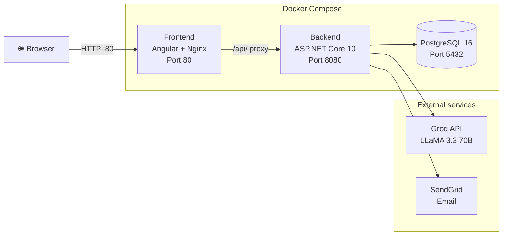
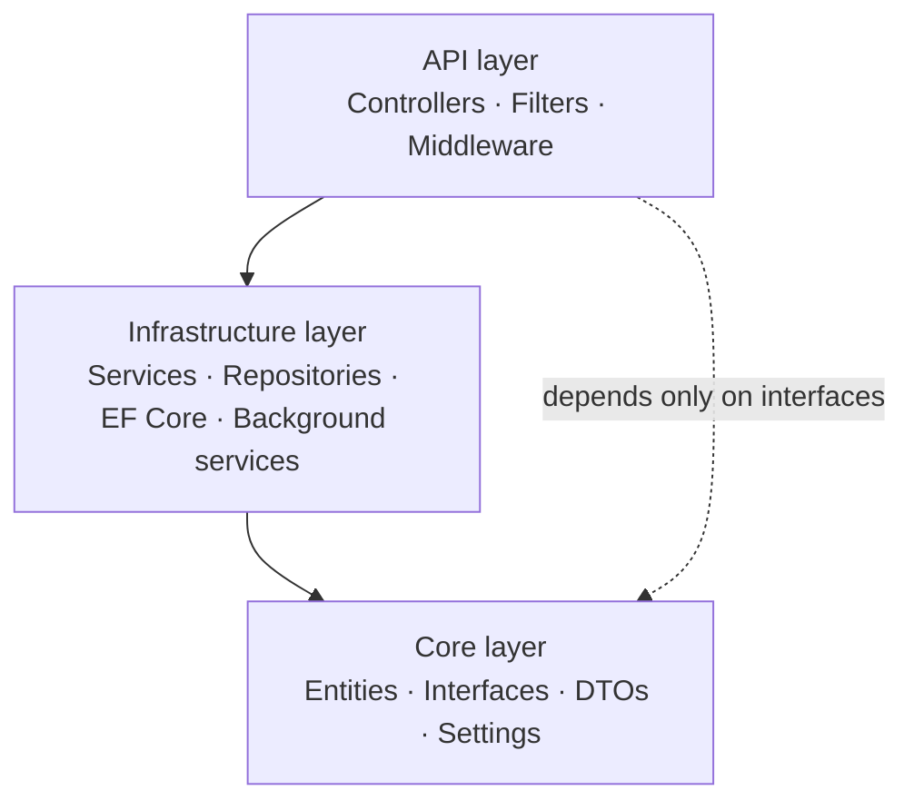
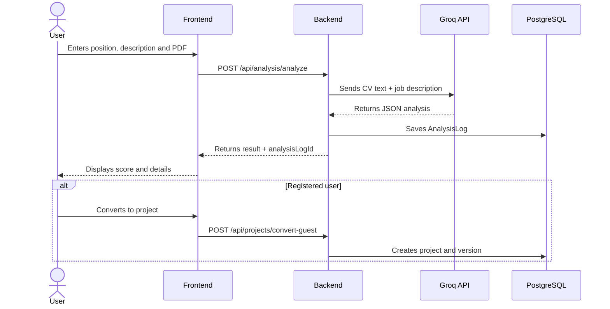

# SmartResumeAnalyzer

An AI platform for CV analysis and job application tracking. The user enters a job title, job description and a PDF CV, and the platform returns a match score, strengths, weaknesses, missing keywords and suggestions for improvement.

## Features

- **AI CV Analysis** — match score, strengths/weaknesses, missing keywords and suggestions for improvement (Groq / LLaMA 3.3 70B)
- **Guest mode** — analysis without registration (3 analyses per day per IP address)
- **Project management** — organizing applications by company and position
- **CV versioning** — multiple CV versions per project with progress tracking
- **Version comparison** — side-by-side comparison of the analyses of two CV versions
- **Sending applications by email** — AI-generated or manually written email via SendGrid
- **Notifications** — automatic reminders for draft applications and response follow-up
- **PDF export** — exporting analysis results as a formatted PDF document
- **User profile** — statistics with application history and score trends

## Technologies

| Layer | Technology |
|------|-------------|
| Frontend | Angular 20 + PrimeNG 20 (Aura theme) |
| Backend | ASP.NET Core 10 — Clean Architecture |
| Database | PostgreSQL 16 + Entity Framework Core |
| AI | Groq API — LLaMA 3.3 70B Versatile |
| Email | SendGrid |
| Authentication | JWT tokens |
| Tests | Selenium WebDriver — Java + JUnit 5 + Maven |
| Containerization | Docker + Docker Compose |

## Architecture

### Infrastructure


```mermaid
graph LR
    Browser["🌐 Browser"]

    subgraph DC["Docker Compose"]
        FE["Frontend<br/>Angular + Nginx<br/>Port 80"]
        BE["Backend<br/>ASP.NET Core 10<br/>Port 8080"]
        DB[("PostgreSQL 16<br/>Port 5432")]
    end

    subgraph EXT["External services"]
        GROQ["Groq API<br/>LLaMA 3.3 70B"]
        SG["SendGrid<br/>Email"]
    end

    Browser -->|"HTTP :80"| FE
    FE -->|"/api/ proxy"| BE
    BE --> DB
    BE --> GROQ
    BE --> SG
```

### Backend — Clean Architecture


```mermaid
graph TB
    API["API layer<br/>Controllers · Filters · Middleware"]
    INF["Infrastructure layer<br/>Services · Repositories · EF Core · Background services"]
    CORE["Core layer<br/>Entities · Interfaces · DTOs · Settings"]

    API --> INF
    INF --> CORE
    API -.->|"depends only on interfaces"| CORE
```

### CV analysis flow


```mermaid
sequenceDiagram
    actor K as User
    participant FE as Frontend
    participant BE as Backend
    participant AI as Groq API
    participant DB as PostgreSQL

    K->>FE: Enters position, description and PDF
    FE->>BE: POST /api/analysis/analyze
    BE->>AI: Sends CV text + job description
    AI-->>BE: Returns JSON analysis
    BE->>DB: Saves AnalysisLog
    BE-->>FE: Returns result + analysisLogId
    FE-->>K: Displays score and details

    alt Registered user
        K->>FE: Converts to project
        FE->>BE: POST /api/projects/convert-guest
        BE->>DB: Creates project and version
    end
```

## Prerequisites

- [Docker](https://www.docker.com/get-started) and Docker Compose
- Git

For local development without Docker:
- [Node.js 20+](https://nodejs.org/) and Angular CLI
- [.NET 10 SDK](https://dotnet.microsoft.com/download)
- PostgreSQL 16

## Running with Docker

### 1. Cloning the repository

```bash
git clone https://github.com/jevticn-dev/smart-resume-analyzer.git
cd smart-resume-analyzer
```

### 2. Configuring environment variables

```bash
cp .env.example .env
```

Edit `.env` and fill in the values:

| Variable | Description |
|-----------|------|
| `POSTGRES_PASSWORD` | PostgreSQL password |
| `JWT_SECRET_KEY` | JWT key for signing tokens (minimum 32 characters) |
| `GROQ_API_KEY` | Groq API key — create one at [console.groq.com](https://console.groq.com) |
| `SENDGRID_API_KEY` | SendGrid API key — create one at [sendgrid.com](https://sendgrid.com) |
| `SENDGRID_FROM_EMAIL` | Verified email sender in the SendGrid account |

### 3. Running

```bash
docker compose up --build
```

The application will be available at **http://localhost**.

> The first run takes a few minutes — the backend waits for PostgreSQL to be ready before applying migrations.

### Stopping

```bash
docker compose down
```

To delete all data (database and uploaded CVs):

```bash
docker compose down -v
```

## Local development (without Docker)

### Database

Run only the database:

```bash
docker compose up postgres
```

### Backend

```bash
cd Backend/SmartResumeAnalyzer.API
dotnet run
```

The backend runs at `https://localhost:7139`. It uses `appsettings.Development.json` — copy it from `appsettings.json` and fill in the values.

### Frontend

```bash
cd Frontend/smart-resume-analyzer
npm install --legacy-peer-deps
ng serve
```

The frontend runs at `http://localhost:4200`.

## Running Selenium tests

The tests require all three application components to be running (frontend + backend + database).

### 1. Test configuration

```bash
cd Selenuim-Tests/src/test/resources
cp test.properties.example test.properties
```

Edit `test.properties`:

| Property | Description |
|----------|------|
| `test.email` | Email of an existing test user |
| `test.password` | Test user password |
| `cv.path` | Path to the PDF CV file used in the tests |
| `hr.email` | Email address used as the HR recipient in email tests |

Place a PDF CV file in `Selenuim-Tests/src/test/resources/` and update `cv.path`.

### 2. Running the tests

```bash
cd Selenuim-Tests
mvn test
```

Running a single test class:

```bash
mvn test -Dtest=FullFlowTest
```

> The tests run in Firefox. WebDriverManager automatically downloads the appropriate driver.

## Project structure

```
smart-resume-analyzer/
│
├── Backend/                                        # ASP.NET Core 10
│   ├── SmartResumeAnalyzer.API/
│   │   ├── Controllers/                            # Analysis, Auth, Project, Email, Notification
│   │   ├── Extensions/                             # DI registrations, JWT configuration
│   │   ├── Filters/                                # RateLimitFilter
│   │   └── Middleware/                             # ExceptionHandlingMiddleware
│   │
│   ├── SmartResumeAnalyzer.Core/
│   │   ├── Configuration/                          # RateLimitSettings
│   │   ├── DTOs/                                   # Analysis, Auth, Email, Notification, Project
│   │   ├── Entities/                               # User, Project, CvVersion, AnalysisLog, Notification
│   │   ├── Exceptions/                             # AppException
│   │   ├── Interfaces/                             # IProjectService, IAuthService, IAnalysisLogService, ...
│   │   └── Settings/                               # JwtSettings, SendGridSettings, FileStorageSettings, ...
│   │
│   └── SmartResumeAnalyzer.Infrastructure/
│       ├── BackgroundServices/                     # NotificationBackgroundService
│       ├── Data/                                   # AppDbContext, Migrations
│       ├── Extensions/                             # InfrastructureServiceExtensions
│       ├── Repositories/                           # ProjectRepository, CvVersionRepository, AnalysisLogRepository
│       └── Services/                               # ProjectService, AuthService, AiAnalysisService, EmailService, ...
│
├── Frontend/
│   └── smart-resume-analyzer/
│       └── src/app/
│           ├── core/
│           │   ├── interceptors/                   # jwt-interceptor
│           │   ├── models/                         # auth, project, analysis, email, notification
│           │   └── services/                       # auth, project, analysis, email, notification, export, toast
│           ├── features/
│           │   ├── analysis/                       # analyze, result
│           │   ├── auth/                           # login, register
│           │   ├── landing/
│           │   ├── profile/
│           │   └── projects/                       # list, detail, create, edit, version-detail, version-compare
│           ├── layout/                             # Navbar
│           └── shared/                             # Reusable components
│
├── Selenuim-Tests/                                 # Java + Maven + JUnit 5
│   └── src/test/java/com/smartresumeanalyzer/
│       ├── base/                                   # BaseTest
│       ├── pages/                                  # Page Object classes
│       └── tests/                                  # AuthTest, ProjectTest, FullFlowTest
│
├── docker-compose.yml
├── .env.example
└── README.md
```

## Key architectural decisions

- **Guest analysis without a repeated AI call** — the `AnalysisLog` table stores every AI response; the frontend keeps only the `analysisLogId` and converts it into a project upon registration without a new AI call
- **PDF files outside wwwroot** — CV files are stored in `uploads/cvs/`, accessible exclusively through a controller; they are never served as static files
- **Clean Architecture boundary** — `IFormFile` is not in the Core layer; file handling stays in the API layer
- **Rate limiting** — `RateLimitFilter` records a call only on a successful response; it is shared between AI analysis and AI email generation
- **Notifications via polling** — 60-second polling instead of SignalR; reminders are time-tolerant (day-level), so WebSocket infrastructure is not justified
- **Controller architecture** — all controllers access the database exclusively through the service layer; there is no direct `AppDbContext` in controllers
- **Docker network** — Nginx proxies `/api/` requests to the backend container; the browser communicates with a single origin, without CORS issues

## Notes

- **SendGrid free plan** — 100 emails per day; a paid plan is required for production
- **Gmail sender** — emails may end up in spam without SendGrid Domain Authentication with a custom domain
- **Groq API** — free tier with limitations; monitor usage at [console.groq.com](https://console.groq.com)
- **JWT key** — use a cryptographically strong key of at least 32 characters in production
